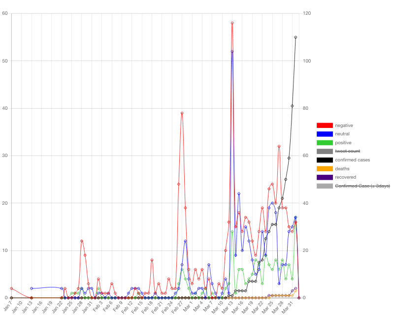
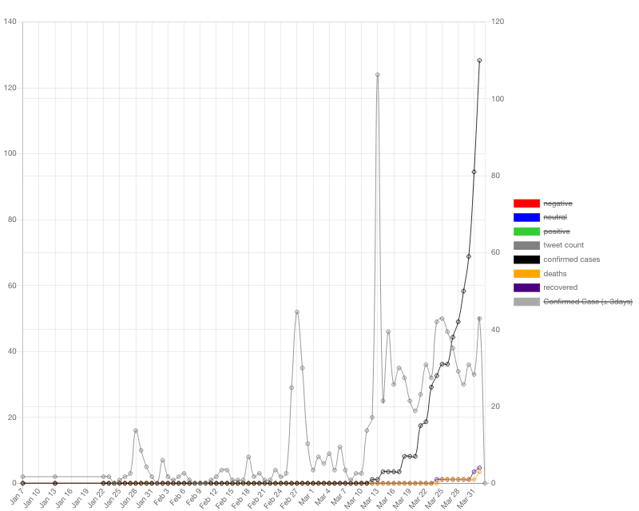
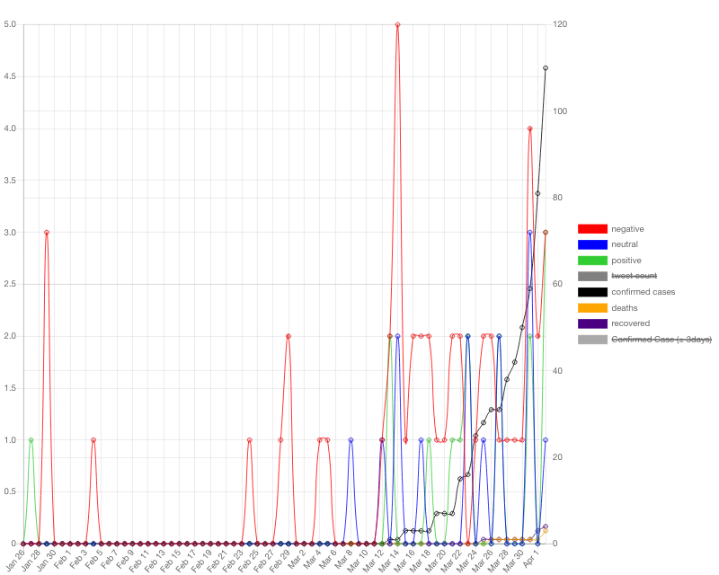
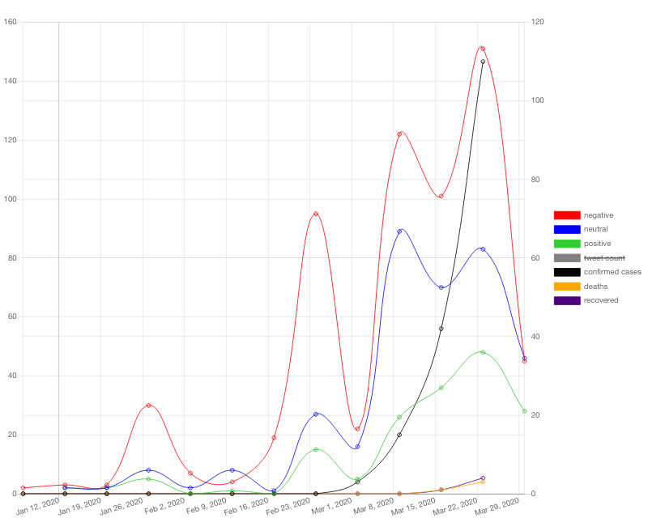
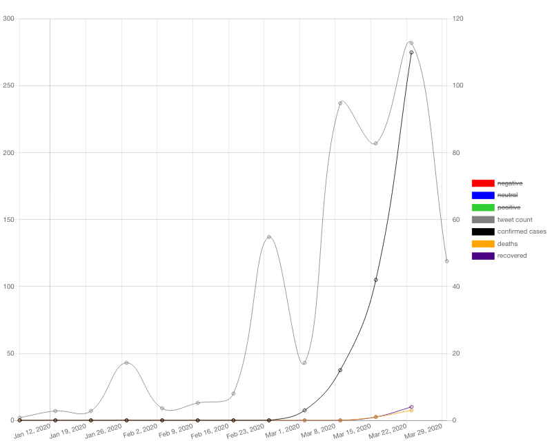
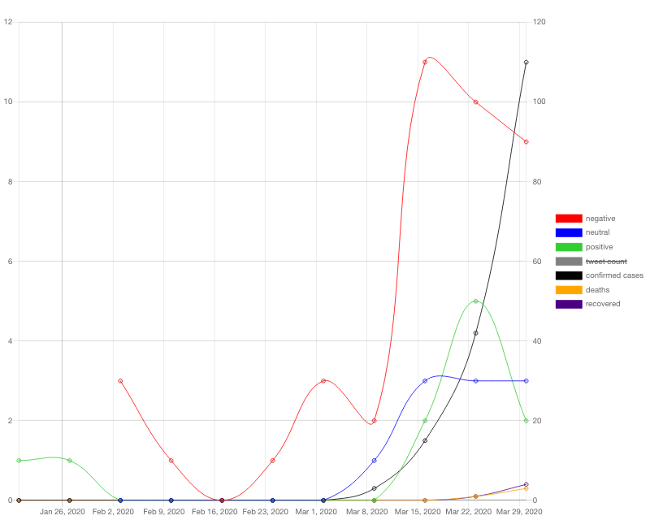
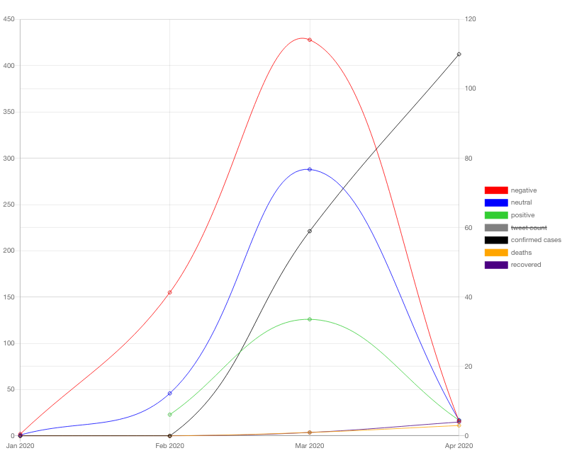
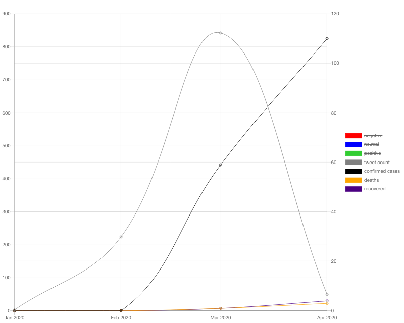
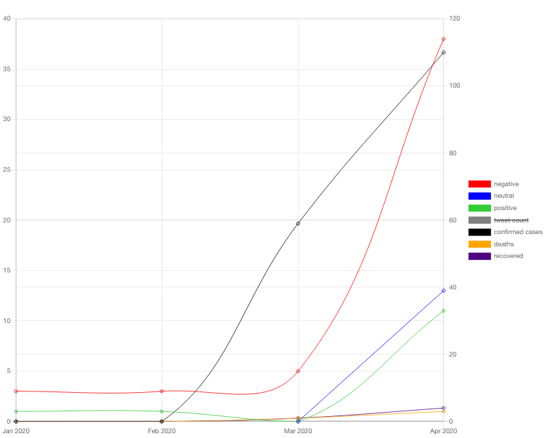

# covid19-nowcast-africa
Detect and analyze the spread of COVID-19 in Africa thanks to social networks led by [BETTINGER Matthieu](https://github.com/mbettinger), [HAFID Salim](https://github.com/SalimINSA) and [SADER Bruno](https://github.com/BrunoSader) for [Humanity & Inclusion](https://hi.org/) in collaboration with the [Fondation INSA Lyon](https://fondation.insa-lyon.fr/).

# Summary
# Research phase
## Corpus and crawler
// Mentionner qu'on a crée des crawlers mais qu'on n'utilise que l'API officielle pour l'app web
## Volumetric Analysis
The idea was to provide the user with a dynamic graph featuring multiple metrics that help better detect and analyze the spread of COVID-19 in HI's countries of intervention. By displaying multiple metrics on a single graph, one can visually see the correlations between metrics and infere useful information.
See Web App Development > Frontend > Graphs for more details on the displayed metrics and the resulting feature.
## Topic Analysis
The social media data being twitter data, it usually consists of a high number of tweets (i.e very short texts) that tackle the COVID-19 issue from a wide variety of angles. To ensure that the user gets a clear grasp of the different topics being talked about when talking about COVID-19 in a specific country, the tool provides a Topic Classification feature.
See Web App Development > Frontend > Topics for more details on the resulting feature.
## Sentimental Analysis
### English 
For the english sentiment analyser, we decided to use a XLNet ([XLNet: Generalized Autoregressive Pretraining for Language Understanding](https://arxiv.org/abs/1906.08237)).  
The XLNet has two major advantages : it outperforms most NLP models (including BERT and RoBERTa) and is easly implementable thanks to transformers (formerly known as pytorch-transformers). 
We finetune the model with a preset of labled tweets focused around COVID-19.
### French
For the french sentiment analyser, we decided to use CamemBERT ([CamemBERT: a Tasty French Language Model](https://arxiv.org/abs/1911.03894)).  
CamemBERT is the only good performing pretrained language model trained on the French data. It is also easly implementable thanks to transformers (formerly known as pytorch-transformers). 
We finetune the model with a preset of labled tweets focused around COVID-19.
## Categorization
### Corpus
In order to categorize text, we needed a large labeled corpus. 
To solve our problem, we decide to crawl different news outlets and use their articles categories as labels for our text.  
Example : We crawled the New-York Times and sorted our corpus into "World", "U.S.", "Politics", "N.Y.", "Business", "Opinion", "Tech", "Science", "Health", "Sports", "Arts", "Books", "Style" "Food"", "Travel", "Magazine" and "T Magazine". 
Out of all the data, we decided to keep only 8 categories that we thought could be of interest ("Politics", "Business", "Tech", "Science", "Health", "Sports", "Food" and "Travel"). 
### Training
Once our data collected, we use a XLNet for the categorizer.  
We train our model on the crawled articles and then finetune it with a preset of categorised tweets focused around COVID-19. 
 
The categorizer has two major flaws. 
- It only works on English data. An improvement would be training a CamemBERT to categorize French data.
- The training data was cut short due to the lack of computing power. In our case, we trained the model on the 20 most frequent words found in each article. An improvement would be to train the model on the full text. 

We believe that for the categorizer a lighter and easier to train model could be used (i.e [NBSVM](https://www.aclweb.org/anthology/P12-2018.pdf)). 

## Cross Analysis

# Web app developement
## Backend
### Consumed APIs
#### Social Media
Social Media APIs are used to gather textual data, which will be used during analyses.
The workflow for using Twitter's API is implemented and tested for Standard (<7days) and Premium (<30days and full archive) uses (see the corresponding [docs](https://developer.twitter.com/en/docs/twitter-api/v1/tweets/search/overview) for more information). 

#### COVID-19 data
John Hopkins' COVID-19 data is used through https://api.covid19api.com/ (https://covid19api.com/ for more information).

### Provided API
The following API was built foremost for suiting specific data exchanges with our frontend, but may be used for other purposes (see below).
| Route | Behavior |
| ------ | ------- |
| /collector| Searches the database for requested data (per Country, Source, Language, a timespan and an amount of data) and completes the DB using a social media API if some timeranges are absent|
| /category | Filters the data subset gathered through /collector on the data category |
| /topics | Generates the desired amount of topics (lists of most relevant words) on the /category data subset|
| /examples | Outputs N texts belonging to the desired topic and generates an N-gram graph on alarming or relevant words |
| /graph | Outputs a shrunk version of the data subset (dates and sentiments only) along with the timespan's COVID-19 cases for graphing purposes |

### Collection Manager

## Frontend
### Used APIs
### Operation and workflows
### Topics
The web app automatically classifies the twitter corpus into N topics (N being a modifiable parameter). A topic consists of a list of the M most frequent/relevant words. For each topic, the web app also allows to view as many tweet examples that fall into that topic as wished.
### Graphs
The web app allows the user to see the cross analysis over a defined period of time. The generated graph displays the tweet count, the sentiments count, the number of confirmed cases, deaths and recoveries collected from John Hopkins' COVID-19 data. The displayed data can be from a specific topic chosen by the user or from all of them. The timeframe can aswell be changed to daily, weekly or monthly allowing the user to easily evaluate trends.  

| Timeframe | All Sentiments | No Sentiments | Only Topic 0 |
| ------ | ------- | ------ | ------|
| Daily | 

| 

| 

|
| Weekly |

| 

| 

|
| Monthly |

| 

| 

|

The graph is generated thanks to [Chart.js](https://www.chartjs.org). The API facilitates the creation of graphs and has numerous built-in functionnalities.
### Improvements
Graph improvements : 
- Change the hover function to show an example of a tweet of a given sentimenet and date.
- Ability to select provinces and regions in countries that provide the information.
- Ability to change daily rolling average from 3 to 7 days.
- Mix topics
# Setup and installation
## Weekly Data Collection Automation
### Prerequisites
>sudo apt-get install cron
### Setup
#### Data collection
##### Data inputs
A .csv can be used to instruct which data shall be collected.
Its format is a list of tuples with a header as follows: 
  >Country,Language,Source(opt, default=twitter),Count(opt, default=100/day)

Example:
  >Country,Lang,Source,Count\
  >France,fr,,200\
  >India,en,,

##### Data collection script
[collector.sh](https://github.com/mbettinger/covid19-nowcast-africa/blob/dev/covid19_autocollector/collector.sh) contains a filepath to a .csv and runs [collector.py](https://github.com/mbettinger/covid19-nowcast-africa/blob/dev/covid19_autocollector/collector.py) with the former as argument. The .csv file shall follow the preceding data format.

##### Data collection interface
[collector.py](https://github.com/mbettinger/covid19-nowcast-africa/blob/dev/covid19_autocollector/collector.py) launches /collector POST queries to the server. See python [collector.py](https://github.com/mbettinger/covid19-nowcast-africa/blob/dev/covid19_autocollector/collector.py) -h output for detailled instructions on its standalone usage.

#### Automation
The preceding files can be orchestrated to be automatically run using cron.
Add a new cron job using:
>crontab -e

Add a new line setting the collection command to be run and its frequency:

Pattern:

>\<cron-frequency\> cd \<path-to-script\> && ./collector.sh (>> \<log-filepath\> 2>&1)
  
Example:

>@weekly cd ~/Documents/HI/covid19_nowcast_africa/covid19_autocollector && ./collector.sh >> ./collector.log 2>&1
